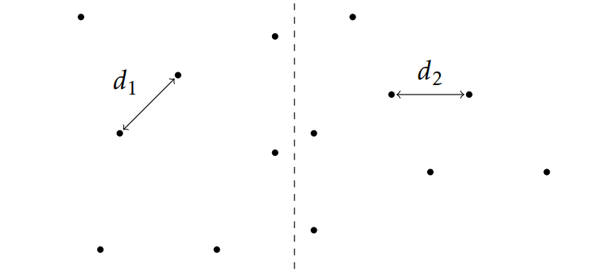

### Problem Description: Closest Points

**Closest Points Problem**

The task is to find the closest pair of points in a set of points on a plane.





**Input:**
A list of n points on a plane.

**Output:**
The minimum distance between a pair of these points.

This computational geometry problem has applications in various fields such as computer graphics and vision. A naive algorithm with quadratic running time iterates through all pairs of points to find the closest pair. Your goal is to design an O(nlogn) time divide and conquer algorithm.

**Approach:**
To solve this problem in O(nlogn) time, let's first split the given n points by an appropriately chosen vertical line into two halves S1 and S2 of size n/2 (assume for simplicity that all x-coordinates of the input points are different). By making two recursive calls for the sets S1 and S2, we find the minimum distances d1 and d2 in these subsets. Let d = min{d1, d2}. It remains to check whether there exist points p1 ∈ S1 and p2 ∈ S2 such that the distance between them is smaller than d.

We narrow down the search to a strip where the x-distance to the middle line is less than or equal to d. To achieve this, we discard points from S1 and S2 outside of this strip.

Next, we sort the points of the strip by their y-coordinates and denote the resulting sorted list by P = [p1, ..., pk]. We exploit the fact that if |i - j| > 7, then the distance between points pi and pj is greater than d. This allows us to efficiently filter pairs of points to check.

**Input Format:**
- The first line contains the number of points n.
- Each of the following n lines defines a point (xi, yi).

**Output Format:**
- The minimum distance.
- The distance between points (x1, y1) and (x2, y2) is equal to sqrt((x1 - x2)^2 + (y1 - y2)^2).

**Constraints:**
- 2 ≤ n ≤ 10^5
- -10^9 ≤ xi, yi ≤ 10^9 are integers.

**Sample Input 1:**
```
2
0 0
3 4
```
**Sample Output 1:**
```
5.0
```

**Sample Input 2:**
```
11
4 4
-2 -2
-3 -4
-1 3
2 3
-4 0
1 1
-1 -1
3 -1
-4 2
-2 4
```
**Sample Output 2:**
```
1.414213
```

Explanation: The smallest distance is √2. There are two pairs of points at this distance: (-1,-1) and (-2,-2); (-2,4) and (-1,3).

This problem can be efficiently solved using a divide and conquer algorithm with a complexity of O(nlogn).